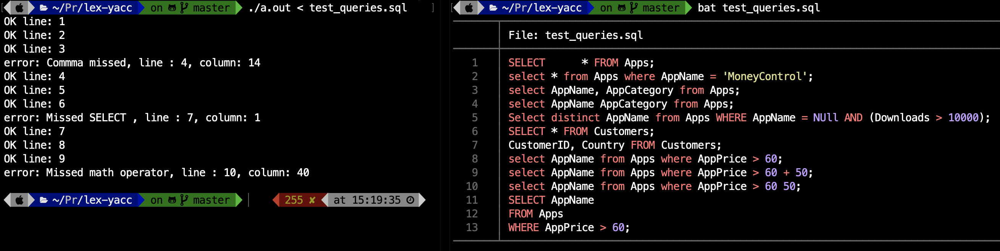
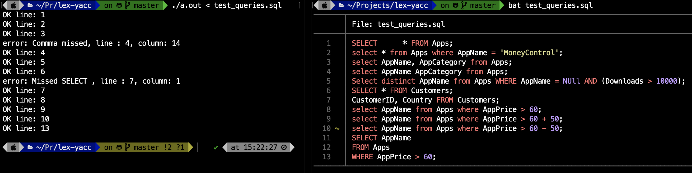

## Running
```bash
lex your-lex-file.l
cc -ll lex.yy.c

# if you want to pass file:
./a.out < input.file

# if you want type smth
./a.out
# End of input:
# UNIX      ctrl + D
# Windows   ctrl + Z

# Running yacc:
yacc -vd your-yacc-file.y
lex your-lex-file.l
cc y.tab.c lex.yy.c
```
### Task: make SQL select-query parser with 3 error handling
```
1. SELECT [DISTINCT|ALL] <список полей> FROM <название 
таблицы>[{, <название таблицы>}...] [WHERE <условие>]
2. <список полей> ::= * | <название поля>[{, <название поля>}...]
3. <условие> ::= <фактор условия> | (<фактор условия>)
4. <фактор условия> ::= <предикат> | <предикат> <условный оператор> <условие> 
5. <предикат> ::= [NOT] <значение поля> <оператор сравнения> <значение поля>
6. <значение поля> ::= <значение> | <название поля>
8. <условный оператор> ::= AND | OR
7. <оператор сравнения> ::= =|<>|<|>|<=|>=
8. <значение> ::= <строка> | <числовое выражение> | NULL | DEFAULT
9. <числовое выражение> ::= <числовой фактор> | (<числовой фактор>)
10. <числовой фактор> ::= <число> | <число> <числовой оператор> <числовое выражение>
11. <числовой оператор>	::= +|-|*|/
12. <название таблицы>, <название поля> ::= <идентификатор>
13. <идентификатор> ::= {<буква>|_}[{<буква>|_|<цифра>}...]
14. <строка> ::= “[<символ>...]”
15. <символ> ::= <цифра> | <буква> | <знак препинания> | <разделитель>
16. <число> ::= [-]<цифра>[<цифра>...].[<цифра>...]
17. <буква> ::= A|B|C|…|Z
18. <цифра> ::= 0|1|…|9
19. <знак препинания> ::= .|,|?|!|;|:
20. <разделитель> ::= \t|\n|\s
```

#Results:


